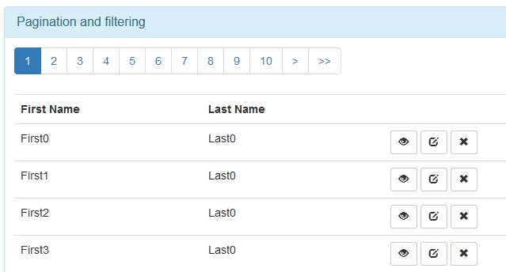

## Introduction

The library is into the lib directory.

The sample can be run on Firefox or running the following commands from this directory

* If you have Python 2.x: python -m SimpleHTTPServer 8000
* If you have Python 3.x: python -m http.server 8000
* If you have Perl:
	* cpan HTTP::Server::Brick   # install dependency
	* perl -MHTTP::Server::Brick -e '$s=HTTP::Server::Brick->new(port=>8000); $s->mount("/"=>{path=>"."}); $s->start'
* If you are under windows: "C:\Program Files (x86)\IIS Express\iisexpress.exe" /path:%CD% /port:8000


## sgGrid

Needing a -simple- dialog system for Angular-JS supporting modals, dynamic templates, dragging, 
and a consisten skin for ALL the dialogs i wrote this small module.

The library is able to open nested modal dialogs, alerts and confirm.

When the count is present:



### Notes

The sample can be run with Firefox, in general or by running, into the directory,

* If you have Python 2.x: python -m SimpleHTTPServer 8000
* If you have Python 3.x: python -m http.server 8000
* If you have Perl:
	* cpan HTTP::Server::Brick   # install dependency
	* perl -MHTTP::Server::Brick -e '$s=HTTP::Server::Brick->new(port=>8000); $s->mount("/"=>{path=>"."}); $s->start'
* If you are under windows: "C:\Program Files (x86)\IIS Express\iisexpress.exe" /path:%CD% /port:8000

### Installation 

* Copy somwehere all the files and include in your main page (e.g. in "app/sgDialogService" directory)
	* sgGrid.js
* Add the dependency on sgGrid module

<pre>
var myApp = angular.module('myApp',['sgGrid']);
</pre>
	
### Usage

#### The controller

The following variables must be set

<pre>
	$scope.data = [];	//The ngModel
	$scope.pageSize = 10;
	$scope.maxPages = 10;
	$scope.totalCount = 0;
	$scope.currentPage = 0;
	$scope.buttons = [];	//The buttons list
</pre>

First a function must be added to build the address of the REST service. It should 
get 

* requiredPage: The 0 based index of the page to retrieve
* pageSize: The number of items for each page
* itemsToRetrieve: The number of items to get

<pre>
	var getAddress = function(requiredPage,pageSize,itemsToRetrieve){
		...
	}
</pre>

A function to get the array of items from the response.

<pre>
	var getResponseData = function(response,headers){
		...
	}
</pre>

A function to get the total number of items from the response

<pre>
	var getTotalCount = function(response,headers){
		...
	}
</pre>

Then the load data function will be as the following. Note that we call getAddress requiring one
item more than the page size, this is to ensure that we know if a next page exists!

<pre>
	$scope.loadData = function(requiredPage){
		//Sanity check
		if(!requiredPage){
			requiredPage = 0;
		}
		
		//Getting the address
		$http.get(getAddress(requiredPage,$scope.pageSize,$scope.pageSize+1))
			.success(function(response, status, headers, config){
				var data = getResponseData(response,header);
				$scope.hasNext = data.length > $scope.pageSize;
				if($scope.hasNext){
					data = data.splice(0,$scope.pageSize);
				}
				//If has a count
				listTotal = getTotalCount(response,headers);
				
				$scope.currentPage = requiredPage;
				$scope.listTotal = listTotal;
				$scope.data = data;
			});
		}
</pre>

### Controller without count

When the service does not return the total number of available items we can work this way.
We use the pageSize+1 element as a marker!

<pre>
	$scope.loadData = function(requiredPage){
		//Sanity check
		if(!requiredPage){
			requiredPage = 0;
		}
		
		//Getting the address
		$http.get(getAddress(requiredPage,$scope.pageSize,$scope.pageSize+1))
			.success(function(response, status, headers, config){
				var data = getResponseData(response,header);
				$scope.hasNext = data.length > $scope.pageSize;
				if($scope.hasNext){
					data = data.splice(0,$scope.pageSize);
				}
				//If has a count
				listTotal =  $scope.pageSize*(requiredPage+1) + ($scope.hasNext?1:0);
				
				$scope.currentPage = requiredPage;
				$scope.listTotal = listTotal;
				$scope.data = data;
			});
		}
</pre>

### The template

We setup the attributes

* ng-model: The container of the data
* sg-page-size: (optional, default 10) The variable on the controller containing the page size. It is watched by
the controller so, changing it will make the list change!
* sg-max-pages: (optional, default 10) The maximum number of shown pages
* sg-current-page: The current page
* sg-count: The variable containing the number of items
* sg-buttons: The lsit of buttons into the enclosing controller
* sg-load-data: The function with signature function(requiredPage) exposed by the enclosing controller

The paginaton buttons contains the fields

* selected: true false
* label:
	* << First
	* < Previous
	* [number] The page number
	* > Next
	* >> Last
* go(): Function to call to navigate to the specific page

```html
<div sg-grid
	ng-model="data"
	sg-page-size="pageSize" 
	sg-load-data="loadData" 
	sg-max-pages="maxPages"
	sg-current-page="currentPage"
	sg-count="listTotal"
	sg-buttons="buttons">
	<nav>
		<ul class="pagination">
			<li ng-repeat="button in buttons" ng-class="{'active':button.selected}">
					<a ng-click="button.go()" >{{button.label}}</a>
			</li>
		</ul>
	</nav>
	<table class="table">
		<tr><th>First Name</th><th>Last Name</th><th>&nbsp;</th></tr>
		<tr ng-repeat="customer in data">
			<td>{{customer.first_name}}</td>
			<td>{{customer.last_name}}</td>
			<td>
				<button type="button" class="btn btn-default btn-sm" ng-click="show(customer)">
					<span class="glyphicon glyphicon-eye-open" aria-hidden="true"></span>
				</button>
			</td>
		</tr>
	</table>
</div>
```

### History

* v 1.0.0, First Release
	* Pagination with or without count
	* Change on pageSize change
